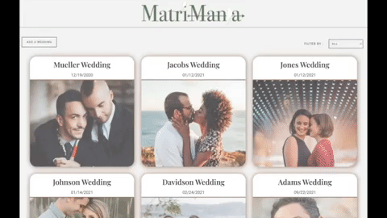
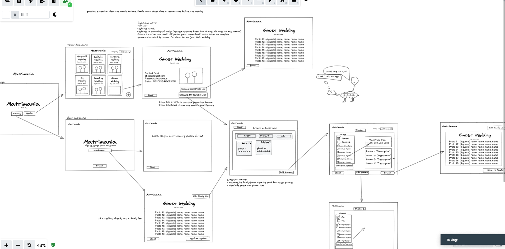
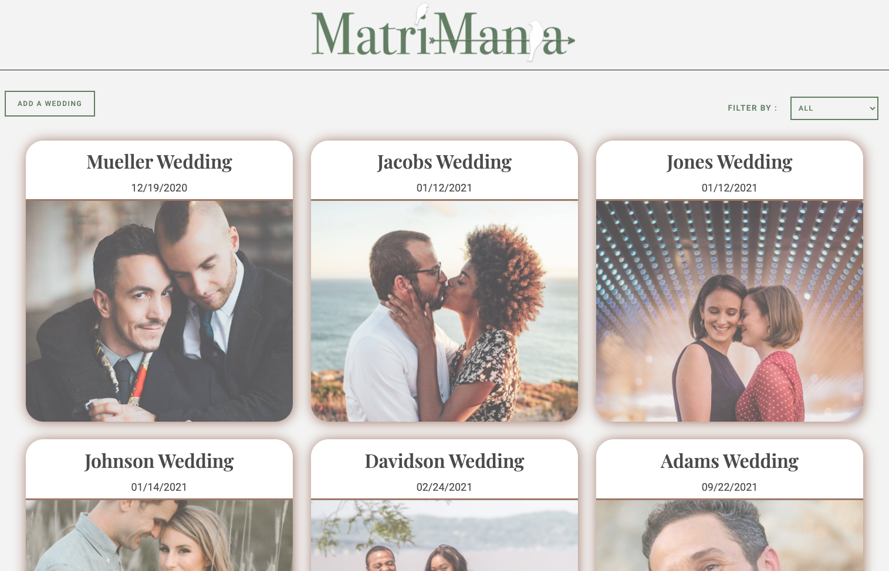
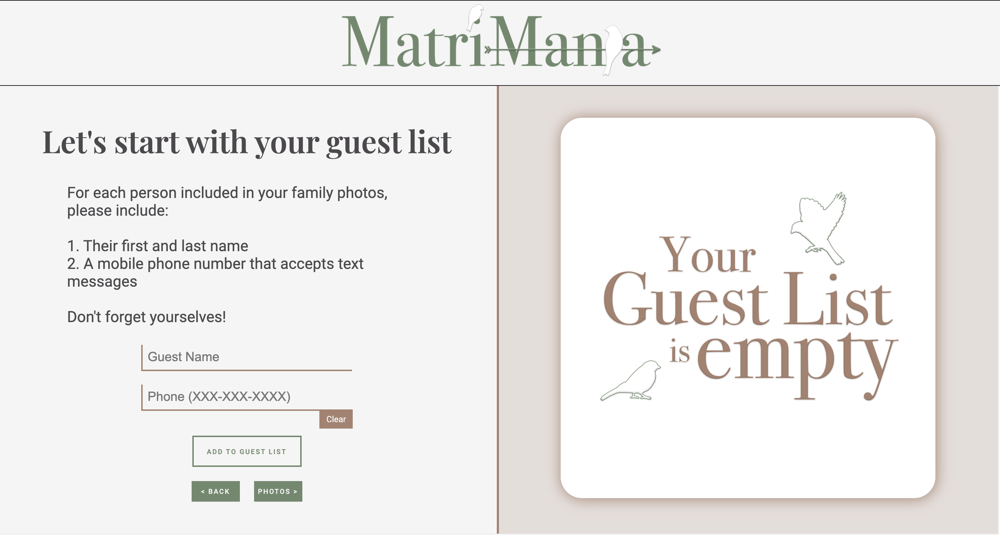
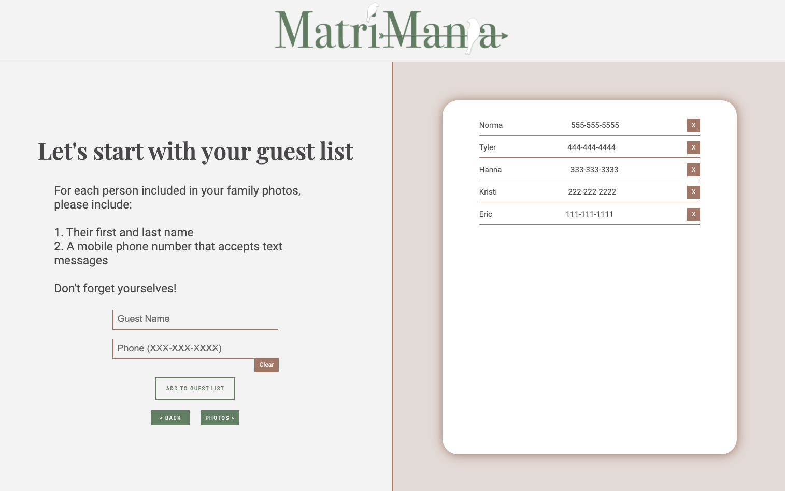
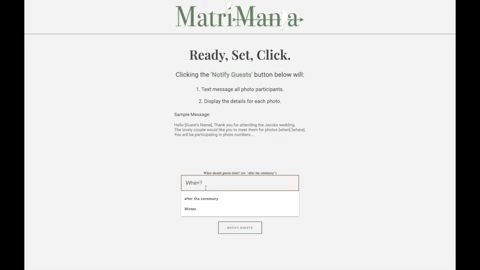

<br />
<p align="center">
  <a href="https://github.com/Matrimania/matrimania-client">
    
  </a>
  <h1 align="center">Matrimania</h1>
  <p align="left">
    Matrimania is a multi-page React application designed to remove the <i>mania</i> of capturing memories of wedding celebrations. <br></br>A vendor (wedding photographer) can organize their upcoming photoshoots, request necessary information from their clients, and access an easy-to-read carousel view of photos they must take during the special day.
    <br /><br>
    See our <a href="https://matrimania-client.herokuapp.com/"> <strong>Deployed App</strong></a> here!
    <br />
  </p>
</p>

## About The Project

### Built With
* TypeScript
* React Hooks
* React Router
* CSS/Styled Components
* Day.js
* Jest & React Testing Library
* Fetch API
* Git/GitHub
* Eslint

### Skills
* OOP using functional components
* Test Driven Development (TDD)
* Git workflow
* AGILE project management

### Installation
To install the application
1. Clone the repo
2. Install NPM packages
3. Start application
4. Open `localhost:3000` in your browser

```
git clone git@github.com:Matrimania/matrimania-client.git
npm install
npm start
```

### Testing
To see test suites:
```
npm test
```

## Where it began
#### WIREFRAME


## Matrimania in Action

Watch our [Virtual Tour](https://www.youtube.com/watch?v=u7SW7DxhqG8)

#### DASHBOARD



#### INDIVIDUAL WEDDING PAGE


#### CREATE A GUESTLIST


#### FILLED GUESTLIST


#### PHOTOSHOOT VIEW


## Wins & Challenges
- This was a greenfield project for both the front-end and back-end teams incorporating technologies we hadn't used before. It was a challenge to build out a client-side application and server in tandem - we did not have all our endpoints available immediately and had to incorporate async fetch calls later in our process.
- A bug we would love to resolve next stems from architectural issues preventing proper renders each time a user fills one of the various forms on the application.

## Next Steps

- The next feature we'd want is for vendors to be able to contact guests on the day of the wedding to inform them when and where their photos will be taken. We planned on incorporating the Twilio API to send text reminders. We decided before this feature is implemented, we want to be able to handle security issues so we don't expose users' private data.
- Additional features would be to allow a user to edit and delete guest and photo lists.

## Contact
- 👤 [Kristi Miller - FE Developer](https://github.com/Kristiannmiller)
- 👤 [Eric Berglund - FE Developer](https://github.com/ericberglund117)
- 👤 [Hanna Kim - FE Developer](https://github.com/hannakim91)
- 👤 [Norma - BE Developer](https://github.com/IamNorma)
- 👤 [Tyler - BE Developer](https://github.com/fieldstyler)

## Additional Links
- [Project Organization](https://github.com/Matrimania)
- [Server Repo](https://github.com/Matrimania/back-end)
- [Client Repo](https://github.com/Matrimania/matrimania-client)
- [Project Board](https://github.com/orgs/Matrimania/projects/1)
